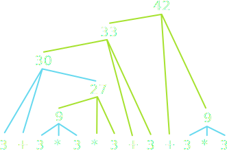

## Problem 1
- Evaluate the following expressions using Python's rules of precedence:

  <br>

  `3 + 3 * 3 * 3 + 3 + 3 * 3`{.inlinecode}

  <br>

  `10 ** ((9 + 8) % 7) + 6 * (5 + 4 + 3 // 2 + 1)`{.inlinecode}


## Precedence Trace #1a



## Precedence Trace #1b


## Problem 2
- Write a python function `max3(a, b, c)` that returns the largest of its three arguments but does so without calling any built-in Python functions.


## A Buggy First Attempt
```{.mypython .badcode style='font-size:.8em'}
def max3(a, b, c):
    """Returns the largest of the three arguments a, b, and c."""
    if a > b and a > c:
        return a
    if b > a and b > c:
        return b
    if c > a and c > b:
        return c
```

- The bug icon indicates that this code has some issues. In what cases would this implementation of `max3` fail?


## Using Nested `if` Statements
```{.mypython style='max-height:900px; font-size:.8em'}
def max3(a, b, c):
    """Returns the largest of the three arguments a, b, and c."""
    if a > b:
        if a > c:
            return a
        else:
            return c
    else:
        if b > c:
            return b
        else:
            return c
```

## Using Decomposition
```{.mypython style='max-height:900px; font-size:.8em'}
def max3(a, b, c):
    """Returns the largest of the three arguments a, b, and c."""
    return max2( a, max2(b, c))

def max2(a, b):
    """Returns the largest of the two arguments a and b."""
    if a > b:
        return a
    else:
        return b
```

## Problem 3
::::::cols
::::{.col style='flex-grow:2'}
:::{.incremental style='font-size:.9em'}
- As far as I know, the only computer scientist to win a Pulitzer prize is Douglas Hofstadter, who won one for _Gödel, Escher, Bach_, a delightful exploration of the intricacies of computation.
- Hofstadter’s book includes many famous mathematical puzzles, including this one:
  - Pick some positive integer and call it n.
  - If n is even, divide it by two.
  - If n is odd, multiply it by three and add one.
  - Continue this process until n is equal to one.
- This sequence is often called the _Hailstone Sequence_, because the numbers go up and down before reaching the end of the process. 
:::
::::

::::col
{width=90%}

::::
::::::

## The Collatz Conjecture
::::::{.cols style='align-items:center'}
::::col
{width=50%}

::::

::::col
The fascinating thing about this problem is that no one has been able to prove that it always stops. The conjecture that this process always terminates is called the _Collatz Conjecture_, and appears in the following XKCD cartoon by Randall Munroe:

::::
::::::


## Tracing the Hailstone Function {data-state="HailstoneTrace"}

<table id="HailstoneTable">
<tbody style="border:none;">
<tr><td> <div id="HailstoneTrace" style="margin:0px; padding:0px;"></div> </td></tr>
<tr>
  <td>
  <div style="display: flex">
  <table style='flex-grow: 2'>
  <tbody>
  <tr><td style='padding:0px'> <div id="HailstoneBanner" style="margin:0px; padding:0px;">Console</div> </td></tr>
  <tr><td style='padding:0px'> <div id="HailstoneConsole" style="margin:0px; padding:0px;"></div> </td></tr>
  </tbody>
  </table>
  <table class="CTControlStrip" style='flex-grow: 1'>
  <tbody>
  <tr>
  <td>
  
  </td>
  <td>
  
  </td>
  </tr>
  </tbody>
  </table>
  </div>
</tr>
</tbody>
</table>

